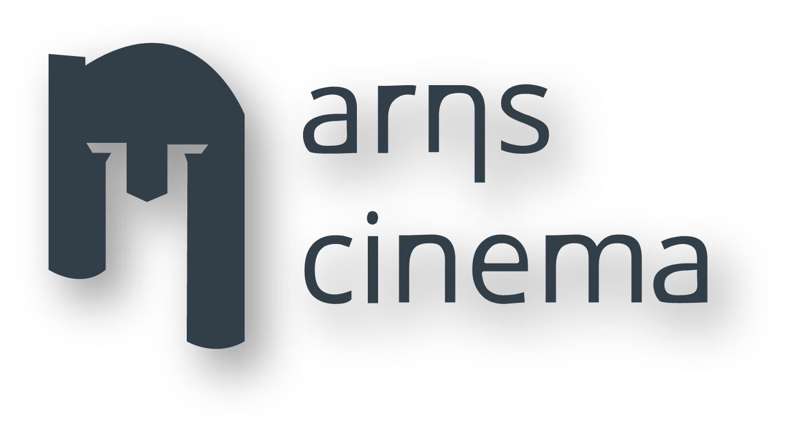
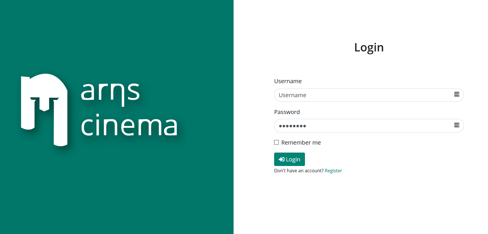
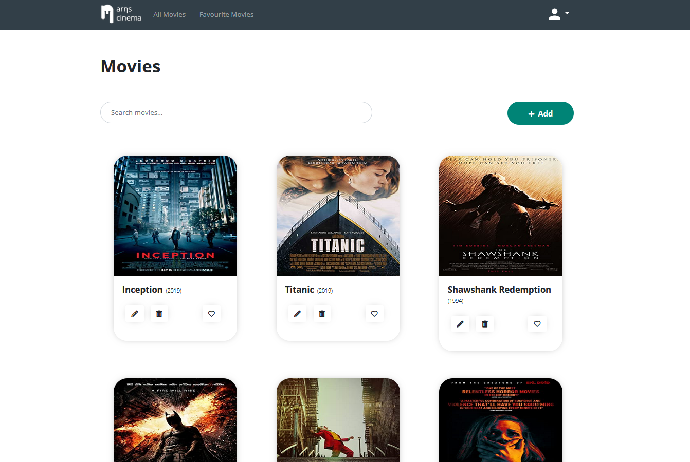
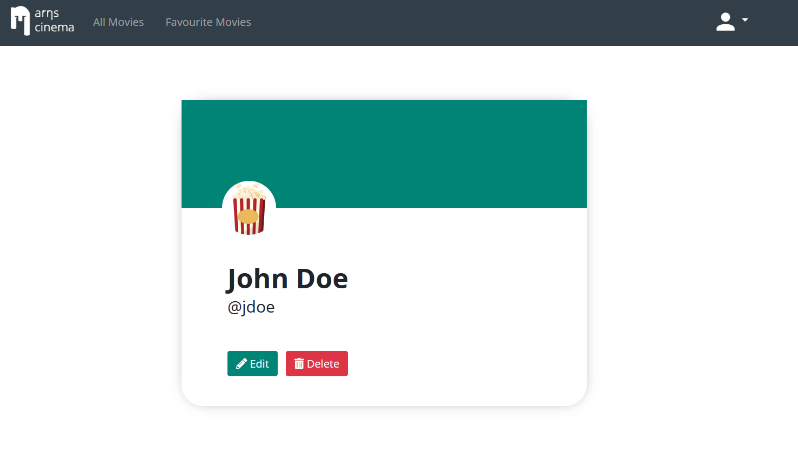
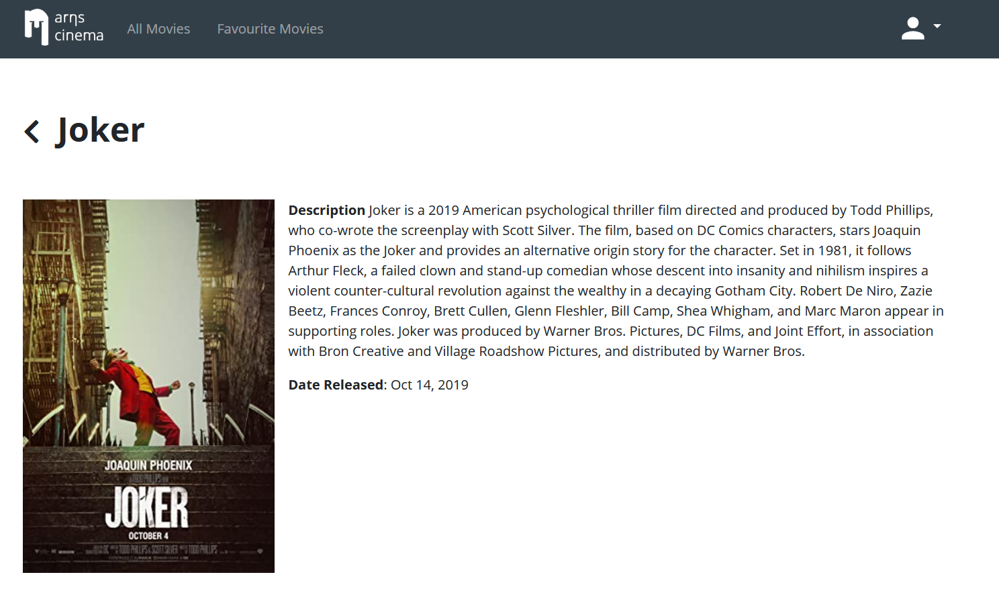

# 🎬 ArhsCinema

This project is the final result of the **Arhs-Development-Hellas Angular Academy**. I participated on Octomber of 2020 and had a lot of fun learning about JavaScript, Typescript, Unit Testing and of course the core concepts of the **Angular Framework**.

## 🖼️ Screenshots

|         Login         |         Movies         |
| :-------------------: | :--------------------: |
|  |  |

|         Profile         |         Movie-Details         |
| :---------------------: | :---------------------------: |
|  |  |

This project was generated with [Angular CLI](https://github.com/angular/angular-cli) version 10.1.2.

## Concepts

In this project, I showcase the following Angular Concepts:

- Guards
- Interceptors
- Node Api Calls
- Omdb Api calls
- Reactive Forms
- Custom Directives

## Development server

Run `ng serve` for a dev server. Navigate to `http://localhost:4200/`. The app will automatically reload if you change any of the source files.

## Build

Run `ng build` to build the project. The build artifacts will be stored in the `dist/` directory. Use the `--prod` flag for a production build.

## Running unit tests

Run `ng test` to execute the unit tests via [Karma](https://karma-runner.github.io).

## Running end-to-end tests

Run `ng e2e` to execute the end-to-end tests via [Protractor](http://www.protractortest.org/).

## Further help

To get more help on the Angular CLI use `ng help` or go check out the [Angular CLI README](https://github.com/angular/angular-cli/blob/master/README.md).
